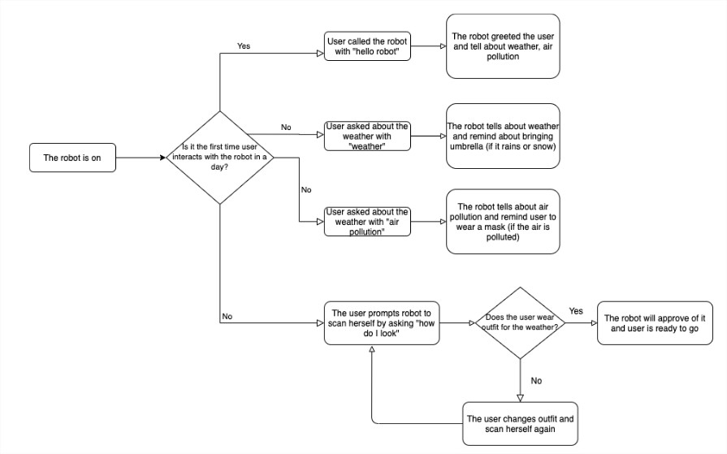

We built a speech-based robot that is able to recommend user what to wear depending on the weather & air condition. We defined the problem to our solution:
> Graduate Students living alone and off-campus need to be aware of the condition outside before going out of their room because their plans, the way they dress, and the equipment they need to bring will depend on the condition outside.

Before getting into development, we made 10(+2) How-Might-We's or candidate solutions to our problems. After we picked solution candidate (based on technology feasibility and time constraint), we created storyboard:
</a>

Also, we came up with overall flow of our system:

