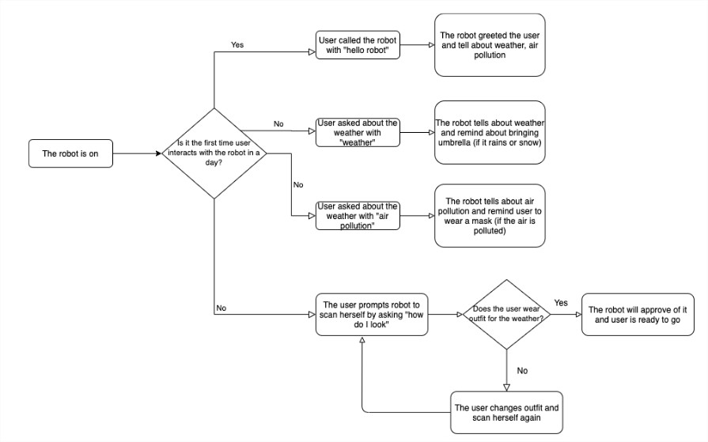

We built a speech-based robot that is able to recommend user what to wear depending on the weather & air condition. First, we asked several graduate students about how the weather change in South Korea influences what they wear and how do they usually deal with it. 

Afterwards, we defined the problem to our solution:
> Graduate Students living alone and off-campus need to be aware of the condition outside before going out of their room because their plans, the way they dress, and the equipment they need to bring will depend on the condition outside.

Before getting into development, we made 10(+2) How-Might-We's or candidate solutions to our problems. After we picked solution candidate (based on technology feasibility and time constraint), we created storyboard:
</img>

Also, we came up with overall flow of our system:
</img>

<b>My role</b>: Took part in designing the interaction between user and the robot using Google Cloud Speech-to-Text and Text-to-Speech and pulling the weather and air condition data from OpenWeather and IQ Air Visual APIs, respectively. 

Check out complete project description & source code on **[Github](https://github.com/WRafell/KSE624FinalProject)**.

**[Check out our demo video!](https://youtu.be/Ts8T8GmhRlA)**

